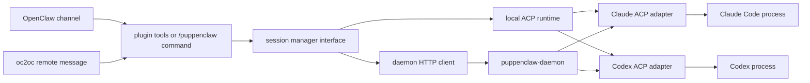

# Puppenclaw


ACP-backed OpenClaw plugin for managing Claude Code and Codex sessions as named background coding agents. It also supports `oc2oc`-mediated remote orchestration, with explicit pure-pipe control when the target conversation opts in.

## What

Puppenclaw gives OpenClaw stable tools and commands for starting, steering, stopping, forking, and inspecting long-lived coding sessions. The runtime is ACP-first so the same orchestration flow can target Claude Code or Codex.

## Install

```bash
openclaw plugins install @puppenclaw/openclaw-plugin
```

## Config

```json
{
  "plugins": {
    "entries": {
      "puppenclaw": {
        "enabled": true,
        "config": {
          "backend": "local",
          "defaultAgent": "claude",
          "permissionMode": "approve-reads",
          "maxSessions": 5,
          "sessionTtlMinutes": 60,
          "streamOutput": true,
          "agentCommands": {
            "claude": "npx -y @zed-industries/claude-agent-acp",
            "codex": "npx @zed-industries/codex-acp"
          },
          "mcpServers": {}
        }
      }
    }
  }
}
```

```json
{
  "plugins": {
    "entries": {
      "puppenclaw": {
        "enabled": true,
        "config": {
          "backend": "daemon",
          "daemonUrl": "http://127.0.0.1:18795",
          "defaultAgent": "codex",
          "permissionMode": "approve-all",
          "remoteControl": {
            "mediated": {
              "enabled": true
            },
            "purePipe": {
              "enabled": false,
              "allowFrom": [],
              "allowedAgents": []
            },
            "requireConversationBinding": true
          }
        }
      }
    }
  }
}
```

## Daemon

For `backend: "daemon"`:

```bash
npx puppenclaw-daemon start --port 18795
```

## Tools

| Tool | Description | Example trigger |
| --- | --- | --- |
| `puppenclaw_start` | Start or reuse a named Claude/Codex ACP session | "Start a codex session in this repo and implement the server side." |
| `puppenclaw_send` | Send another instruction into a running session | "Tell that session to run tests and continue." |
| `puppenclaw_status` | Show one session or list all sessions | "Check the puppenclaw status." |
| `puppenclaw_stop` | Stop a session | "Stop the background codex session." |
| `puppenclaw_resume` | Resume a stopped session | "Resume the session and continue." |
| `puppenclaw_fork` | Branch a session into a new named session | "Fork the current implementation into an alternative branch." |
| `puppenclaw_cost` | Show recorded usage counters | "Show the token usage for that session." |

## Commands

The `/puppenclaw` command mirrors the same operations for deterministic remote control over text channels:

```text
/puppenclaw start {"agent":"codex","name":"api-refactor","directory":".","task":"Implement the server side."}
/puppenclaw send {"name":"api-refactor","message":"Continue and run tests.","stream":true}
/puppenclaw bind
/puppenclaw expose {"agents":["codex"],"allowPurePipe":true}
```

## Architecture



## Security

- ACP permission mode is explicit: `approve-reads`, `approve-all`, or `deny-all`.
- Pure-pipe remote control is gated behind conversation binding plus explicit exposure.
- Session metadata and exposure state are stored under Puppenclaw-owned plugin state.
- MCP server config is accepted and tracked, but adapter-side injection still depends on the configured ACP agent command.

## Development

```bash
npm install
npm run test
npm run build
```

## License

MIT
